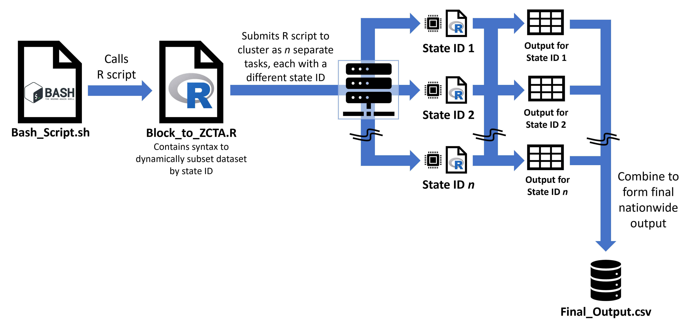

# HPC Batch Jobs

A micro-tutorial on submitting batch jobs in HPC environments such as SLURM/SGE.

## Overview

This document provides an introduction to batch job submission in High Performance Computing (HPC) environments. 

Please note that the syntax and configuration for job submission can vary across different HPC systems. If you're using an HPC cluster at your university or institution, consult your institution's specific documentation for details on job submission, resource allocation, and other requirements.

## What are computing clusters?

**Computing clusters** are sets of interconnected computers (nodes) that work together to perform tasks by distributing the workload across multiple machines. **Supercomputers** are a specialized type of large-scale computing cluster, designed for top-tier performance and optimized for handling extremely complex computations.

**HPC computing clusters** are a subset of computing clusters, often supercomputers, specifically designed to handle and execute high-performance tasks simultaneously. These systems are essential for processing large datasets, as they pool significant amounts of CPU and memory to enable rapid computation of complex tasks (Princeton Research Computing, 2024).

## Job Scheduling Systems in HPC Clusters

HPC clusters rely on **job scheduling systems** to efficiently manage computational tasks across numerous users/jobs. These systems allow multiple users to submit **batch jobs** by allocating resources and executing parallel tasks in a coordinated manner. Jobs will be placed in **queues** and executed when the requested resources become available.

Several job scheduling systems are commonly used in HPC environments, each offering different features, capabilities, and configuration options. The choice of a job scheduler often depends on the specific configuration requirements of the HPC cluster.

Examples of different job scheduling systems in University clusters include:

* Boston University's Shared Computing Cluster ([SCC](https://www.bu.edu/tech/support/research/computing-resources/scc/)) has an **SGE configuration** in their HPC cluster (as of 2024).
* Harvard University’s Faculty of Arts and Sciences Research Computing Center ([FASRC](https://www.rc.fas.harvard.edu/)) uses a **SLURM configuration** for their HPC cluster (as of 2024). 

Major technology companies also offer cloud computing services that include access to HPC nodes, providing scalable solutions for intensive computational tasks.

## How can HPC batch jobs accelerate climate and health research?

Climate and health research often involves the processing of big data — massive datasets that would be difficult, time-consuming, or impossible to analyze on a typical personal computer. HPC batch jobs on a cluster can greatly facilitate this type of data analysis.

For example, suppose you have a script that processes average *daily* fine particulate matter (PM<sub>2.5</sub>) concentrations for US counties using data from a *high-resolution* air quality model. Running this code for the entire US on a personal computer would take an extremely long time and likely require more memory (RAM) than what a regular PC can handle. Instead, you could adapt your code to process one county at a time and then queue the jobs to be executed on different nodes of an HPC cluster. Each node would process a county separately and simultaneously (a technique often referred to as **batch computing**), which could reduce the processing time from weeks to hours, depending on the size of the data and the efficiency of the code.s

## Batch Job Submission Scripts

The files linked below are templates of **batch job submission scripts**:

* [sge_script_template.sh](./sge_script_template.sh) A template for submitting jobs on an SGE-configured cluster. 
* [slurm_script_template.sbatch](./slurm_script_template.sbatch) A template for submitting jobs on a SLURM-configured cluster.

Notice that the SLURM script uses the `.sbatch` extension, while the SGE script uses the `.sh` extension. This reflects a **common convention**: `.sbatch` is often used to indicate a SLURM job submission script, while `.sh` is generally used for shell scripts like those used in SGE. However, these extensions are not strict requirements. For example, you could use and `.sge` extension` for SGE scripts if you prefer.

### Key job parameters

These scripts contain placeholders for key job configuration parameters, such as:

* **Job name** the name of the job.
* **Requested resources** such as:
    + CPU cores
    + memory (RAM)
* **Commands** the `bash` commands that the job will execute.
    
You can customize these scripts by replacing the placeholders with your specific job details.

### Modules

`module` is a command that allows you to load and unload software packages and libraries for a job running in an HPC cluster. In the template scripts, you can see the `module load` command, which loads the necessary software modules before executing the job. 

Examples of software modules include Python, R, MATLAB, and other programming languages or tools. The software modules available on the cluster may vary. For example, the BU cluster may have an R installation named `R/4.2.2`, but in the harvard cluster is named `R/4.2.2-fasrc01`. 

Consult the cluster documentation or system administrators for more information. Note that not all HPC clusters have `module` installed, so be sure to check the specific documentation for your cluster.

### Job Submission

**SGE** To submit a job using the template scripts, you would typically use a command like `qsub` for SGE or `sbatch` for SLURM. For example, to submit an SGE job using the template script, you would run:

```bash
qsub -t 1-50 sge_script_template.sh
```

The `-t 1-50` flag specifies that the job should be run 50 times, with each run having a different task ID from 1 to 50. This is useful for running the same job with different input parameters. The value of the task ID can be accessed within the script using the `$SGE_TASK_ID` variable.

**SLURM** To submit a job using the SLURM template script, you would use the `sbatch` command. For example:

```bash
sbatch slurm_script_template.sbatch
```

This command submits the job to the SLURM scheduler for execution. The argument `--array=1-50` inside the template script [slurm_script_template.sbatch](./slurm_script_template.sbatch) specifies that the job should be run 50 times, with each run having a different task ID from 1 to 50. The value of the task ID can be accessed within the script using the `$SLURM_ARRAY_TASK_ID` variable.


## Working Example 

For a practical example, refer to the scripts found at [https://github.com/Climate-CAFE/block2zcta_xwalk](https://github.com/Climate-CAFE/block2zcta_xwalk). Both and SGE and SLURM scripts are provided for creating a census-block-to-ZCTA crosswalk for each state in the US.

The syntax and process will be similar for any other application of distributed computing, though you should remember that the exact syntax used differs on the computing cluster's operating system (OS) and job scheduling system/configuration.

The general process is illustrated in the figure below:



*R logo image credit*: © 2016 The R Foundation, reproduced under [CC-BY-SA 4.0 license](https://creativecommons.org/licenses/by-sa/4.0/) and obtained from https://www.r-project.org/logo/

### References
- Princeton Research Computing. 2024. "What is a cluster?" Accessed on 3 January. https://researchcomputing.princeton.edu/faq/what-is-a-cluster
- Dartmouth College, Research Computing Services Portal [Slurm overview](https://services.dartmouth.edu/TDClient/1806/Portal/KB/ArticleDet?ID=132625)
- Boston University, Research Computing Supposrt [Submitting your batch job] https://www.bu.edu/tech/support/research/system-usage/running-jobs/submitting-jobs/
- Harvard University, Faculty of Arts and Sciences Research Computer [Running jobs](https://docs.rc.fas.harvard.edu/kb/running-jobs/)
- University of Texas at Austin, Texas Advanced Computer Center [Submit a batch job using the sbatch command](https://docs.tacc.utexas.edu/hpc/frontera/#running-sbatch)
